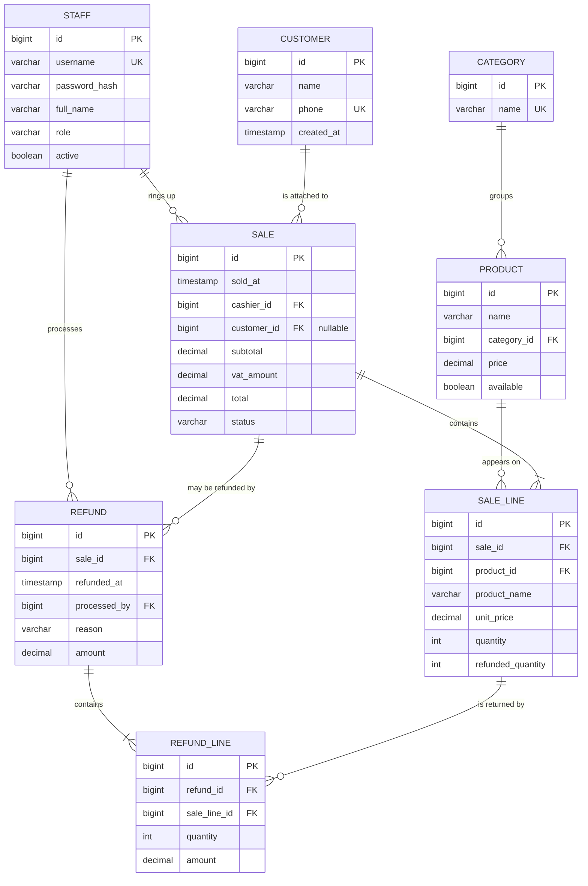

# Database Design

**Café POS — Advanced Software Engineering Project**

> **Note for Vanessa (issue #6):** this is a working draft built from the entities
> already on `main` (`src/main/java/zm/cafe/pos/domain/`). It is complete enough to
> hand in, but please: (1) check every table against the code before submission,
> (2) if the lecturer wants a drawn ER diagram from a tool (draw.io / Lucidchart),
> reproduce the Mermaid diagram below there and paste the image, (3) expand the
> narrative in your own words where marked _[expand]_.

---

## 1. Design approach

The system stores the day-to-day trading data of a single café outlet: who works
the till, what is on the menu, every sale and its line items, the customers who
choose to be recorded, and any refunds.

- **Model:** relational. Eight tables, third normal form (3NF), with three
  deliberate and documented denormalisations for audit safety and reporting speed
  (Section 5.4).
- **Engine:** the application runs on file-based **H2** by default and on **MySQL 8**
  via the `mysql` Spring profile. Types below are given in generic SQL with the
  MySQL spelling in brackets where they differ.
- **Schema creation:** Hibernate generates the physical schema from the JPA
  entities (`spring.jpa.hibernate.ddl-auto=update`). This document is the logical
  design that the generated schema matches; the `CREATE TABLE` script in
  Appendix A is the same design written by hand.
- **Keys:** every table has a surrogate primary key `id` (`BIGINT`,
  auto-increment). Natural keys (`username`, `category.name`, `customer.phone`)
  are enforced with `UNIQUE` constraints.
- **Money:** stored as `DECIMAL` (never floating point). Prices are **VAT-inclusive**;
  VAT is standard-rated at **16%** and is broken out on the receipt, not stored per
  line. Currency is Zambian Kwacha (K) throughout.

---

## 2. Entities

| Entity | Purpose |
|---|---|
| `staff` | A café employee who can log in to the POS. |
| `category` | A menu grouping, e.g. Coffee, Pastries. |
| `product` | A sellable menu item with a price. |
| `customer` | A returning customer, matched at the till by phone number. |
| `sale` | One completed transaction at the till. |
| `sale_line` | One product line within a sale (quantity, price snapshot). |
| `refund` | Money returned against a past sale (full or partial). |
| `refund_line` | One line of a partial refund: some quantity of a `sale_line`. |

---

## 3. Entity–Relationship Diagram



**Cardinality summary**

| Relationship | Type | Meaning |
|---|---|---|
| staff → sale | 1 : many | A cashier rings up many sales; each sale has exactly one cashier. |
| staff → refund | 1 : many | A staff member processes many refunds; each refund names one. |
| customer → sale | 1 : many (optional) | A sale may have no customer (walk-in) or one; a customer has many sales. |
| category → product | 1 : many | A category groups many products; each product is in exactly one category. |
| product → sale_line | 1 : many | A product appears on many sale lines. |
| sale → sale_line | 1 : many (mandatory) | Every sale has at least one line. |
| sale → refund | 1 : many (optional) | A sale may be refunded zero or more times (partials add up). |
| refund → refund_line | 1 : many (mandatory) | Every refund has at least one line. |
| sale_line → refund_line | 1 : many | A line can be refunded across several partial refunds. |

---

## 4. Data dictionary

Common to every table: `id` — `BIGINT`, `PRIMARY KEY`, auto-increment
(MySQL `BIGINT AUTO_INCREMENT`, H2 `IDENTITY`). Not repeated in the rows below.

### 4.1 `staff`

| Column | Type | Constraints | Notes |
|---|---|---|---|
| `username` | `VARCHAR(40)` | `NOT NULL`, `UNIQUE` | Login name. |
| `password_hash` | `VARCHAR(255)` | `NOT NULL` | BCrypt hash — never the plain password. |
| `full_name` | `VARCHAR(80)` | `NOT NULL` | Shown in the top bar and on receipts. |
| `role` | `VARCHAR(20)` | `NOT NULL` | `CASHIER` or `MANAGER`. |
| `active` | `BOOLEAN` | `NOT NULL`, default `TRUE` | Inactive staff cannot log in. |

### 4.2 `category`

| Column | Type | Constraints | Notes |
|---|---|---|---|
| `name` | `VARCHAR(40)` | `NOT NULL`, `UNIQUE` | e.g. Coffee, Tea, Pastries, Food, Cold Drinks. |

### 4.3 `product`

| Column | Type | Constraints | Notes |
|---|---|---|---|
| `name` | `VARCHAR(80)` | `NOT NULL` | Menu item name. |
| `category_id` | `BIGINT` | `NOT NULL`, `FK → category(id)` | Owning category. |
| `price` | `DECIMAL(10,2)` | `NOT NULL`, `CHECK (price > 0)` | VAT-inclusive unit price in K. |
| `available` | `BOOLEAN` | `NOT NULL`, default `TRUE` | Retiring an item sets this `FALSE` instead of deleting, so old sale lines stay valid. |

### 4.4 `customer`

| Column | Type | Constraints | Notes |
|---|---|---|---|
| `name` | `VARCHAR(80)` | `NOT NULL` | Customer name. |
| `phone` | `VARCHAR(20)` | `UNIQUE`, nullable | Primary lookup key for purchase history. Unique when present. |
| `created_at` | `TIMESTAMP` | `NOT NULL` | When the record was first created. |

### 4.5 `sale`

| Column | Type | Constraints | Notes |
|---|---|---|---|
| `sold_at` | `TIMESTAMP` | `NOT NULL` | Date and time the sale was completed. |
| `cashier_id` | `BIGINT` | `NOT NULL`, `FK → staff(id)` | Who rang it up. |
| `customer_id` | `BIGINT` | nullable, `FK → customer(id)` | Attached customer, or `NULL` for a walk-in. |
| `subtotal` | `DECIMAL(12,2)` | `NOT NULL` | Net of VAT (`total ÷ 1.16`). |
| `vat_amount` | `DECIMAL(12,2)` | `NOT NULL` | `total − subtotal`. |
| `total` | `DECIMAL(12,2)` | `NOT NULL` | What the customer paid = sum of line totals. |
| `status` | `VARCHAR(20)` | `NOT NULL` | `COMPLETED`, `PARTIALLY_REFUNDED`, or `REFUNDED`. |

### 4.6 `sale_line`

| Column | Type | Constraints | Notes |
|---|---|---|---|
| `sale_id` | `BIGINT` | `NOT NULL`, `FK → sale(id)` | Owning sale. |
| `product_id` | `BIGINT` | `NOT NULL`, `FK → product(id)` | Product sold. |
| `product_name` | `VARCHAR(80)` | `NOT NULL` | **Snapshot** of the product name at sale time. |
| `unit_price` | `DECIMAL(10,2)` | `NOT NULL` | **Snapshot** of the price at sale time. |
| `quantity` | `INT` | `NOT NULL`, `CHECK (quantity > 0)` | Units sold on this line. |
| `refunded_quantity` | `INT` | `NOT NULL`, default `0` | Units of this line already refunded; `0 ≤ refunded_quantity ≤ quantity`. |

### 4.7 `refund`

| Column | Type | Constraints | Notes |
|---|---|---|---|
| `sale_id` | `BIGINT` | `NOT NULL`, `FK → sale(id)` | Sale being refunded. |
| `refunded_at` | `TIMESTAMP` | `NOT NULL` | When the refund was processed. House rule: same calendar day as `sale.sold_at`. |
| `processed_by` | `BIGINT` | `NOT NULL`, `FK → staff(id)` | Logged-in staff member who authorised it. |
| `reason` | `VARCHAR(200)` | `NOT NULL` | Free-text reason. |
| `amount` | `DECIMAL(12,2)` | `NOT NULL` | Sum of this refund's line amounts (VAT-inclusive). |

### 4.8 `refund_line`

| Column | Type | Constraints | Notes |
|---|---|---|---|
| `refund_id` | `BIGINT` | `NOT NULL`, `FK → refund(id)` | Owning refund. |
| `sale_line_id` | `BIGINT` | `NOT NULL`, `FK → sale_line(id)` | Line being returned. |
| `quantity` | `INT` | `NOT NULL`, `CHECK (quantity > 0)` | Units returned; cannot exceed the line's remaining quantity. |
| `amount` | `DECIMAL(12,2)` | `NOT NULL` | `unit_price × quantity`. |

---

## 5. Normalisation

The design is derived by normalising a single "sales receipt" record — the paper
document the till would otherwise produce — from unnormalised form to 3NF.

### 5.1 Unnormalised form (UNF)

A receipt as one record, with a **repeating group** for the items:

```
SALE( sale_id, sold_at,
      cashier_name, cashier_role,
      customer_name, customer_phone,
      ( item_name, item_category, unit_price, qty, line_total )*,   ← repeats
      subtotal, vat, total )
```

Problems: the repeating group cannot be stored in a single relational row;
`cashier_role`, `item_category` etc. are repeated on every receipt.

### 5.2 First Normal Form (1NF) — remove repeating groups, ensure atomic values

Split the repeating items into their own relation. Every column now holds a single
atomic value and every row is unique.

```
SALE_1NF( sale_id PK, sold_at,
          cashier_name, cashier_role,
          customer_name, customer_phone,
          subtotal, vat, total )

SALE_ITEM_1NF( sale_id PK/FK, line_no PK,
               item_name, item_category, unit_price, qty, line_total )
```

Key of `SALE_ITEM_1NF` is the composite `(sale_id, line_no)`.

### 5.3 Second Normal Form (2NF) — remove partial dependencies

2NF: be in 1NF **and** every non-key attribute depends on the *whole* key.

In `SALE_ITEM_1NF` the candidate business key is `(sale_id, item_name)`.
`item_category` depends on `item_name` **alone** — a partial dependency — and so do
the catalogue values for `unit_price`. Move product facts into their own relation:

```
PRODUCT_2NF( product_id PK, name, category, price )

SALE_ITEM_2NF( sale_id PK/FK, product_id PK/FK,
               unit_price, qty )        -- unit_price kept as a sale-time snapshot
```

`line_total` is removed — it is `unit_price × qty`, fully derivable (see 5.4 for the
one case where a derived total is deliberately kept).

`SALE_1NF` has a single-column key (`sale_id`), so it is already in 2NF.

### 5.4 Third Normal Form (3NF) — remove transitive dependencies

3NF: be in 2NF **and** no non-key attribute depends on another non-key attribute.

**`SALE_1NF`:**
- `cashier_role` depends on `cashier_name`, not on `sale_id` — transitive.
  → move staff facts to `STAFF( id PK, username, full_name, role, ... )`;
  `SALE` keeps `cashier_id` as a foreign key.
- `customer_name`, `customer_phone` depend on the customer, not the sale — transitive.
  → move to `CUSTOMER( id PK, name, phone, ... )`; `SALE` keeps `customer_id`
  (nullable) as a foreign key.

**`PRODUCT_2NF`:**
- `category` is a free-standing descriptive value that would be repeated across
  every product in that category. → move to `CATEGORY( id PK, name )`;
  `PRODUCT` keeps `category_id` as a foreign key.

The result is exactly the eight tables in Section 4.

### 5.5 Deliberate denormalisations (documented exceptions)

Three redundancies are kept **on purpose**. Each is a conscious trade-off, not an
oversight:

| Redundant data | Why it is kept |
|---|---|
| `sale_line.product_name`, `sale_line.unit_price` (duplicate `product`) | A receipt must reprint **exactly** as it was issued, even after the product is renamed, re-priced, or retired. The snapshot makes historical sales immutable. |
| `sale.subtotal`, `sale.vat_amount`, `sale.total` (derivable from the lines) | Stored so the transaction list and reports do not have to re-sum every sale, and so the recorded takings are an auditable figure fixed at sale time. |
| `sale_line.refunded_quantity` (derivable from `SUM(refund_line.quantity)`) | Lets the refund screen check "how many units are still refundable" with a single column read and a simple `CHECK` constraint. |

All other data is in 3NF.

---

## 6. Referential integrity and indexes

**Foreign keys** (all `ON DELETE RESTRICT` — trading records are never cascade-deleted):

| Child | Column | Parent |
|---|---|---|
| `product` | `category_id` | `category(id)` |
| `sale` | `cashier_id` | `staff(id)` |
| `sale` | `customer_id` | `customer(id)` (nullable) |
| `sale_line` | `sale_id` | `sale(id)` |
| `sale_line` | `product_id` | `product(id)` |
| `refund` | `sale_id` | `sale(id)` |
| `refund` | `processed_by` | `staff(id)` |
| `refund_line` | `refund_id` | `refund(id)` |
| `refund_line` | `sale_line_id` | `sale_line(id)` |

**Indexes** (beyond the automatic primary-key and unique-constraint indexes):

| Index | Column(s) | Serves |
|---|---|---|
| `ix_customer_phone` | `customer(phone)` unique | Returning-customer lookup at the till. |
| `ix_sale_sold_at` | `sale(sold_at)` | Transaction history date-range filter. |
| `ix_sale_customer` | `sale(customer_id)` | A customer's purchase history. |
| `ix_sale_line_sale` | `sale_line(sale_id)` | Loading a sale with its lines. |
| `ix_refund_sale` | `refund(sale_id)` | Refunds against a sale. |

---

## 7. How the design meets the requirements

| Requirement (from the brief) | Where it lives in the schema |
|---|---|
| Log in as a member of staff | `staff` (username, `password_hash`, `role`, `active`). |
| Record sales / "the amount being recorded" | `sale.total` per transaction; café takings = `SUM(sale.total)`. |
| Retrieve previous transactions | `sale` + `sale_line`, queried by date (`ix_sale_sold_at`) or customer. |
| Provision for a refund | `refund` + `refund_line`; full or partial; `sale.status` tracks the outcome. |
| Show the people who have bought | `customer` joined to `sale`. |
| Show a returning customer their past sales | `sale WHERE customer_id = ?` ordered by `sold_at` — driven by the phone lookup. |
| 16% VAT on receipts | `sale.subtotal` / `sale.vat_amount` / `sale.total`; VAT rate is a constant in the app. |
| Manage the menu and prices | `category`, `product` (`price`, `available`). |

---

## Appendix A — `CREATE TABLE` script (MySQL flavour)

```sql
CREATE TABLE staff (
    id            BIGINT AUTO_INCREMENT PRIMARY KEY,
    username      VARCHAR(40)  NOT NULL UNIQUE,
    password_hash VARCHAR(255) NOT NULL,
    full_name     VARCHAR(80)  NOT NULL,
    role          VARCHAR(20)  NOT NULL,
    active        BOOLEAN      NOT NULL DEFAULT TRUE
);

CREATE TABLE category (
    id   BIGINT AUTO_INCREMENT PRIMARY KEY,
    name VARCHAR(40) NOT NULL UNIQUE
);

CREATE TABLE product (
    id          BIGINT AUTO_INCREMENT PRIMARY KEY,
    name        VARCHAR(80)   NOT NULL,
    category_id BIGINT        NOT NULL,
    price       DECIMAL(10,2) NOT NULL,
    available   BOOLEAN       NOT NULL DEFAULT TRUE,
    CONSTRAINT fk_product_category FOREIGN KEY (category_id) REFERENCES category(id),
    CONSTRAINT ck_product_price CHECK (price > 0)
);

CREATE TABLE customer (
    id         BIGINT AUTO_INCREMENT PRIMARY KEY,
    name       VARCHAR(80) NOT NULL,
    phone      VARCHAR(20) UNIQUE,
    created_at TIMESTAMP   NOT NULL
);

CREATE TABLE sale (
    id          BIGINT AUTO_INCREMENT PRIMARY KEY,
    sold_at     TIMESTAMP     NOT NULL,
    cashier_id  BIGINT        NOT NULL,
    customer_id BIGINT        NULL,
    subtotal    DECIMAL(12,2) NOT NULL,
    vat_amount  DECIMAL(12,2) NOT NULL,
    total       DECIMAL(12,2) NOT NULL,
    status      VARCHAR(20)   NOT NULL,
    CONSTRAINT fk_sale_cashier  FOREIGN KEY (cashier_id)  REFERENCES staff(id),
    CONSTRAINT fk_sale_customer FOREIGN KEY (customer_id) REFERENCES customer(id)
);

CREATE TABLE sale_line (
    id                BIGINT AUTO_INCREMENT PRIMARY KEY,
    sale_id           BIGINT        NOT NULL,
    product_id        BIGINT        NOT NULL,
    product_name      VARCHAR(80)   NOT NULL,
    unit_price        DECIMAL(10,2) NOT NULL,
    quantity          INT           NOT NULL,
    refunded_quantity INT           NOT NULL DEFAULT 0,
    CONSTRAINT fk_line_sale    FOREIGN KEY (sale_id)    REFERENCES sale(id),
    CONSTRAINT fk_line_product FOREIGN KEY (product_id) REFERENCES product(id),
    CONSTRAINT ck_line_qty CHECK (quantity > 0),
    CONSTRAINT ck_line_refqty CHECK (refunded_quantity >= 0 AND refunded_quantity <= quantity)
);

CREATE TABLE refund (
    id           BIGINT AUTO_INCREMENT PRIMARY KEY,
    sale_id      BIGINT        NOT NULL,
    refunded_at  TIMESTAMP     NOT NULL,
    processed_by BIGINT        NOT NULL,
    reason       VARCHAR(200)  NOT NULL,
    amount       DECIMAL(12,2) NOT NULL,
    CONSTRAINT fk_refund_sale  FOREIGN KEY (sale_id)      REFERENCES sale(id),
    CONSTRAINT fk_refund_staff FOREIGN KEY (processed_by) REFERENCES staff(id)
);

CREATE TABLE refund_line (
    id           BIGINT AUTO_INCREMENT PRIMARY KEY,
    refund_id    BIGINT        NOT NULL,
    sale_line_id BIGINT        NOT NULL,
    quantity     INT           NOT NULL,
    amount       DECIMAL(12,2) NOT NULL,
    CONSTRAINT fk_rline_refund FOREIGN KEY (refund_id)    REFERENCES refund(id),
    CONSTRAINT fk_rline_line   FOREIGN KEY (sale_line_id) REFERENCES sale_line(id),
    CONSTRAINT ck_rline_qty CHECK (quantity > 0)
);

CREATE INDEX ix_sale_sold_at    ON sale(sold_at);
CREATE INDEX ix_sale_customer   ON sale(customer_id);
CREATE INDEX ix_sale_line_sale  ON sale_line(sale_id);
CREATE INDEX ix_refund_sale     ON refund(sale_id);
```

---

## Appendix B — Sample data (from `DataSeeder`)

- **Staff:** `manager` / `manager123` (MANAGER), `cashier` / `cashier123` (CASHIER).
- **Categories:** Coffee, Tea, Pastries, Food, Cold Drinks.
- **Products (16):** Espresso K18.00, Americano K22.00, Cappuccino K28.00,
  Café Latte K30.00, Rooibos Tea K15.00, English Breakfast Tea K15.00,
  Ginger & Lemon Tea K18.00, Butter Croissant K20.00, Chocolate Muffin K22.00,
  Scone with Jam K18.00, Chicken Mayo Sandwich K45.00, Beef Burger & Chips K85.00,
  Vegetable Samosa (2) K25.00, Bottled Water 500ml K10.00, Coca-Cola 300ml K15.00,
  Fresh Orange Juice K35.00.
- **Customers:** Chanda Mwale (0977123456), Natasha Phiri (0966987654).
